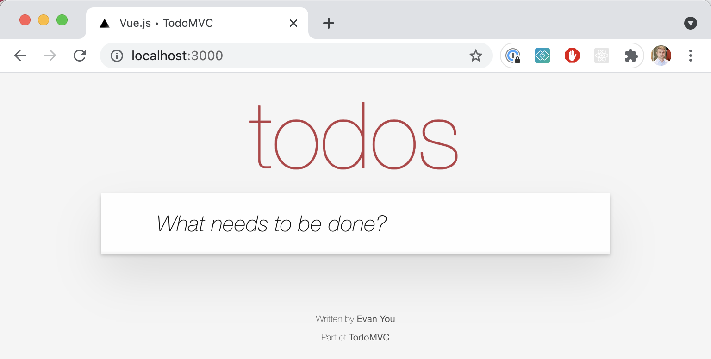
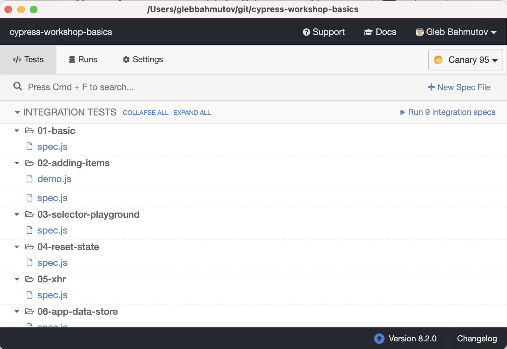

# cypress-basics


## Requirements

- Any computer: Mac, Windows, Linux
- [Node 16+ (LTS)](https://nodejs.org/)
- [NVM](https://github.com/nvm-sh/nvm?tab=readme-ov-file)
- [git](https://git-scm.com)

Check the Node version

```
$ node -v
# for example v18.13.0
$ npm -v
# for example 8.19.3
$ nvm -v
# for example 1.1.1
```

### Clone the repo

In order to get the code and install NPM dependencies, first clone my repo to your local machine.

```bash
git clone git_url

Cloning into ...
```

### Install NPM dependencies

Change the working folder to the cloned repository folder

```bash
cd cypress-workshop-basics
```

The cloned repo has the file `package.json` with all NPM dependencies. Let's install these NPM dependencies

```bash
npm install
```

If necessary, install dependencies inside TodoMVC folder.

```bash
cd todomvc
npm install
```

### Quick check ✅

You can test the installation by starting TodoMVC in the first terminal window

Note: remember to run the below command in the **root folder of the project**
Use the below command to check the folder path
```shell
pwd
```

use the below command to navigate to the root folder of the project

```shell
cd path/to/root/folder
cd ..
```
or
```shell
cd ..
```

use the below command to start the server
```shell
npm start
```

and you should see in the terminal

```text
> json-server --static . data.json --middlewares ./node_modules/json-server-reset


```

If you open your browser and type "localhost:3000" you should see the web application running:




Resources
http://localhost:3000/todos

Home
http://localhost:3000

From the second terminal window you should be able to open Cypress in the root of the project with

```bash
$ npm run cy:open

> cypress-workshop-basics@1.0.0 cy:open /git/cypress-workshop-basics
> cypress open
```

You should see the Cypress Desktop window appear and show the list of test files (specs).


