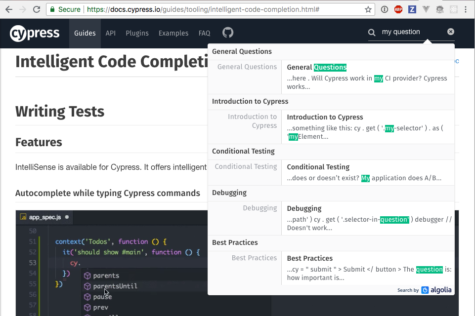

## ☀️ Starting new projects

### 📚 You will learn

- Cypress folder structure
- Writing the first test
- Setting up intelligent code completion
- Cypress documentation

---

## Quick check: Node.js

```bash
$ node -v
v18.14.2
$ npm -v
9.5.0
# optional:
$ yarn -v
1.22.19
```

---

## Todo: make a new project and add Cypress

Create a new folder

- `cd /tmp`
- `mkdir example`
- `cd example`
- `npm init --yes`
- `npm install -D cypress`

+++

### How to open Cypress

```shell
npx cypress open
# or
yarn cypress open
# or
$(npm bin)/cypress open
# or
./node_modules/.bin/cypress open
```

+++

## 💡 Pro tip

In `package.json` I usually have

```json
{
  "scripts": {
    "cy:open": "cypress open",
    "cy:run": "cypress run"
  }
}
```

And I use `npm run cy:open`

---


+++


+++


+++


---

## Cypress files and folders

- "cypress.config.js" - all Cypress settings
- "cypress/e2e" - end-to-end test files (specs)
- "cypress/fixtures" - mock data <!-- .element: class="fragment" -->
- "cypress/support" - shared commands, utilities <!-- .element: class="fragment" -->


---

## Configuration

```js
// cypress.config.js
// https://on.cypress.io/configuration
module.exports = defineConfig({
  // common settings
  viewportWidth: 800,
  viewportHeight: 1000,
  e2e: {
    // end-to-end settings
    baseUrl: 'http://localhost:3000'
  },
  component: {
    // component testing settings
    devServer: {
      framework: 'create-react-app',
      bundler: 'webpack'
    }
  }
})
```

---


## First spec

Let's test our TodoMVC application. Create a new spec file

- `cypress/e2e/spec.cy.js`

**tip:** the default spec pattern is `cypress/e2e/**/*.cy.{js,jsx,ts,tsx}`

+++

Type into the `spec.cy.js` our first test

```javascript
it('loads', () => {
  cy.visit('localhost:3000')
})
```

+++

- make sure you have started TodoMVC in another terminal with `npm start`
- click on "spec.cy.js" in Cypress GUI

+++

## Questions

- what does Cypress do?
- what happens when the server is down? <!-- .element: class="fragment" -->
  - stop the application server running in folder `todomvc`
  - reload the tests

---


---

## Docs

Your best friend is [https://docs.cypress.io/](https://docs.cypress.io/) search



+++

## TODO: Find at docs.cypress.io

- Cypress main features and how it works docs <!-- .element: class="fragment" -->
- core concepts <!-- .element: class="fragment" -->
- command API <!-- .element: class="fragment" -->
  - how many commands are there?
- frequently asked questions <!-- .element: class="fragment" -->

+++

## 💡 Pro tip

```text
https://on.cypress.io/<command>
```

The above URL goes right to the documentation for that command.

+++

## Todo: find at docs.cypress.io

- documentation for `click`, `type`, and `contains` commands
- assertions examples <!-- .element: class="fragment" -->

---

## Todo: Find at docs.cypress.io

- examples
  - recipes
  - tutorial videos
  - example applications
  - blogs
  - FAQ
- Cypress changelog and roadmap

Note:
We should know where to find information later on. Main resources is the api page [https://on.cypress.io/api](https://on.cypress.io/api)

---

## 🏁 Conclusions

- set up IntelliSense
- use Docs at [https://docs.cypress.io/](https://docs.cypress.io/)
- use my [cypress.tips/search](https://cypress.tips/search)

➡️ Next: [01-basic](?p=01-basic) chapter
