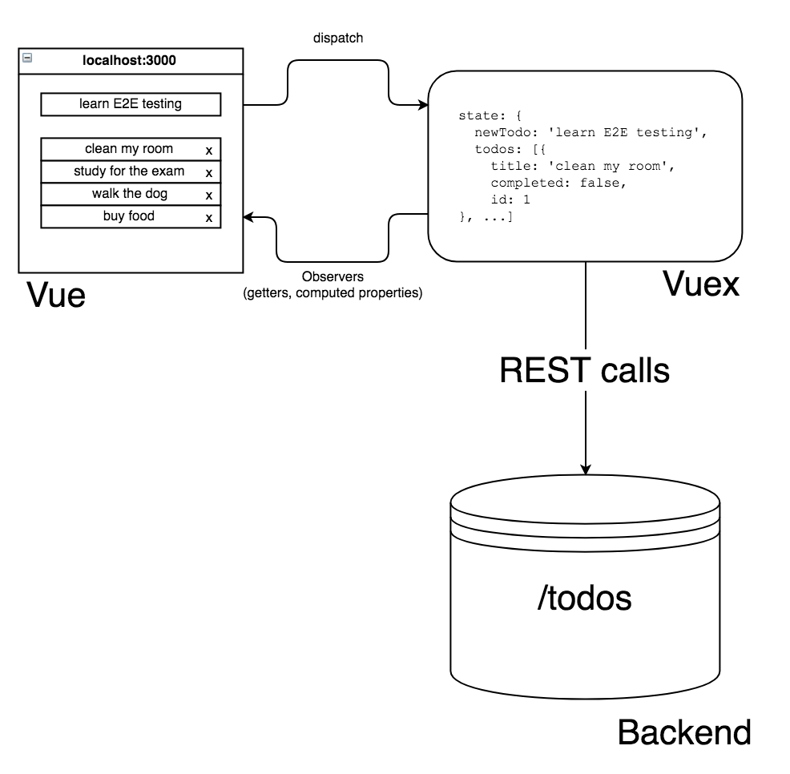

# Cypress: Basics

Contents: 

[00-start](?p=00-start)

[01-basic](?p=01-basic) 

[02-adding-items](?p=02-adding-items) 

[03-selector-playground](?p=03-selector-playground)

+++

---
Application Architecture

+++

This app has been coded and described in this blog post [https://www.cypress.io/blog/2017/11/28/testing-vue-web-application-with-vuex-data-store-and-rest-backend/](https://www.cypress.io/blog/2017/11/28/testing-vue-web-application-with-vuex-data-store-and-rest-backend/)

---

## End of introduction

➡️ Next: [00-start](?p=00-start) chapter
